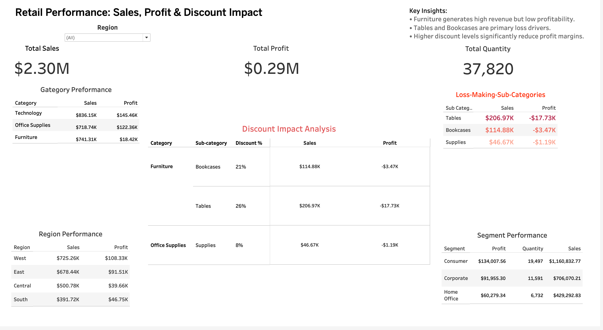

# 📊 Retail Sales & Profit Optimization Analysis


## Table of Contents

- [Project Overview](#project-overview)
- [Business Problem](#business-problem)
- [Tools Used](#tools-used)
- [Dataset](#dataset)
- [Data Cleaning](#data-cleaning)
- [SQL Analysis Performed](#sql-analysis-performed)
- [Key Insights](#key-insights)
- [Business Recommendations](#business-recommendations)
- [Tableau Dashboard](#tableau-dashboard)
- [Files Included](#files-included)
- [Conclusion](#conclusion)
- [Author](#author)


---

## 📊 Project Overview
This project analyzes retail sales data to evaluate business performance across product categories, sub-categories, customer segments, and regions. The main goal was to identify which products drive profit, which ones cause losses, and how discounting affects profitability.

Using SQL, I cleaned the dataset, checked for duplicates, and performed exploratory analysis to uncover key business insights. The findings show that some high-sales products were actually unprofitable, largely due to aggressive discounting.

---

## 💼 Business Problem
The business wants to improve profitability by understanding:

- Which categories and sub-categories generate the most sales  
- Which products generate the most profit  
- Which products are losing money  
- How discounts affect profit  
- Which customer segments and regions perform best  

---

## 🛠️ Tools Used
- PostgreSQL  
- pgAdmin 4  
- Tableau Public  
- GitHub  

---

## 📁 Dataset
Source: Adapted from a retail Superstore dataset (Kaggle)
Description: Transactional retail dataset containing sales, profit, discount, quantity, category, sub-category, region, and customer segment information.

📌 Data Preparation:

Cleaned and structured using SQL
Removed unnecessary fields and standardized column names
Focused on profitability and discount analysis

📌 Note: The dataset used in this project is a modified and cleaned version of publicly available Superstore data.

---

## 🧹 Data Cleaning
Before starting the analysis, the data was cleaned in SQL.

Cleaning steps included:
- Imported CSV data into PostgreSQL  
- Standardized column names for easier querying  
- Checked total row count after import  
- Identified duplicate records  
- Removed **17 duplicate rows**  
- Confirmed cleaned dataset contained **9,977 unique records**  

---

## 🧠 SQL Analysis Performed

The analysis focused on answering key business questions such as total sales and profit, category performance, loss-making products, and the impact of discounts on profitability.

## 🛠 SQL Analysis (Key Queries)

The following queries highlight key steps used to analyze profitability and category performance.

### Profit by Category

```sql
SELECT 
    category, 
    SUM(profit) AS total_profit
FROM superstore_sales
GROUP BY category
ORDER BY total_profit DESC;
```

### Profit Margin by Category

```sql
SELECT 
    category, 
    SUM(profit) / SUM(sales) AS profit_margin
FROM superstore_sales
GROUP BY category;
```

---

## Key Insights

- **High sales ≠ high profit:** Some products like Tables generate strong revenue but result in significant losses.

- **Loss-making sub-categories identified:** Tables, Bookcases, and Supplies contribute negatively to overall profit.

- **Top profit drivers:** Copiers, Phones, Accessories, and Paper generate the highest profits.

- **Discounts reduce profitability:** Discounts above 20% frequently lead to negative profit across multiple categories.

- **Profitability threshold:** Most products remain profitable within a 0%–20% discount range.

- **Regional variation in discount impact:** The East region shows higher discount levels and weaker profitability compared to the West, indicating inconsistent pricing strategies across regions.

### Category Profitability Insight

Despite contributing over 32% of total sales, Furniture has a very low profit margin of only 2.5%, suggesting pricing inefficiencies or high costs. In contrast, Technology combines the highest sales share (36%) with strong profit margins (17%), making it the most valuable category for growth. Office Supplies shows stable and balanced performance across both sales and profitability.

---

## Business Recommendations

- **Limit discounts:** Keep discounts below 20% to protect profit margins and avoid loss-making transactions.

- **Fix loss-making products:** Review pricing and cost structure for Tables, Bookcases, and Supplies, particularly within the Furniture category.

- **Focus on high-profit items:** Increase promotion and sales efforts for Copiers, Phones, and Accessories to maximize returns.

- **Use data-driven pricing:** Apply discounts strategically based on product-level profitability and margin performance.

- **Standardize discount strategy:** Align discount practices in underperforming regions (e.g., East) with more stable regions like the West to improve profitability.
  
---

## 📊 Tableau Dashboard
[View Interactive Dashboard](https://public.tableau.com/views/RetailProfitabilityDiscountAnalysis/Dashboard1?:language=en-US&:sid=&:redirect=auth&:display_count=n&:origin=viz_share_link)



### 📌 Dashboard Overview

This dashboard provides an interactive view of retail performance, allowing users to explore how sales, profit, and discount levels vary across categories, regions, and customer segments. It highlights key loss-making areas and the impact of discounting on profitability.

- Profit by sub-category  
- Sales by category  
- Discount vs profit patterns  
- Regional and segment performance 

---

## 📁 Files Included
- README.md – project overview and findings  
- SQL queries used for analysis  
- Tableau dashboard (link or screenshots)  
- Dataset (or dataset source link)  

---

## 🏁 Conclusion
This project demonstrates how SQL can be used to clean data, analyze business performance, and generate actionable insights. The analysis revealed that high sales do not always lead to profitability, especially when discounting is not controlled. By identifying loss-making products and discount-sensitive categories, this project provides valuable recommendations for improving business performance.

---

## 👤 Author
Alaa Razaq
